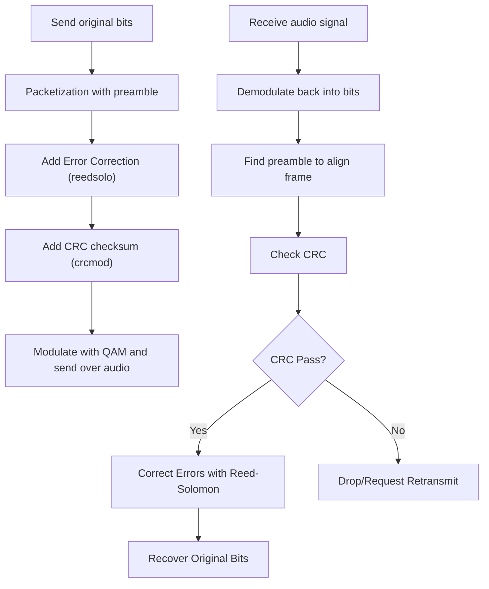

# Data Transfer Protocols
A repository for managing effective, efficient transmission of data from the vehicle to the control operations team for competition environments. We are planning to use the same protocol of voice calls, SMS, and StarLink.

Raspi **Sender**: When data is transferred in (via a POST to our Flask REST API), we encode it using Apache Avro (chose this due to its dynamic nature), transform that into audio wav's, send through whatever protocol we designate. Each requires a different feature and thus file. Inside the sender folder

- `restapi.py` - the flask api for receiving our data
- `data_encoder.py` - dealing with avro encodings for various data types from raspi
- `telephone/audio.py` - using 16-QAM to modulate avro data into voice call data (.wav)
- `telephone/sender.py` - pushing the voice call data

Laptop **Receiver**: When we receive data, we need to decode it and make a websocket endpoint for the frontend to subscribe to and display received + decoded data. Same features but it is a websocket instead of POST.

- `websocket.py` - for the frontend to subscribe to
- `data_decoder.py` - deconstruct the apache avro data into json for the frontend to subscribe to
- `telephone/audio_decoder.py` - use the FFT to feature extract the different channels of data
- `telephone/receiver.py` - establishing/accepting the voice call request from the sender

## Dependencies

Need to install portaudio from homebrew (mac) in order to build the pyaudio dependency that listens on the computer port for some silly testing purposes. Might not be quite useful/relevant.

### how to run

To run these files individually, we can (not the only way) just do `python -m receiver.telephone.audio_decoder` from the root of this project.

# Error Correction Techniques

Since the system is not perfect even if we are testing completely locally (which should be perfect), we need ways to remedy these error rates.

### Logging

So we finished implementing the decoder, and wanted to try it out where the encoder writes the bit into wav and let the demodulator do its work. The longer the bits (like 164) the higher the error rate (0.47 for 164 bits). The potential issues could be:

| Cause | Explanation |
| :--- | :--- |
| Timing offset | When you generate the wave, each symbol is aligned nicely. But when you read and process it, your sampling may not perfectly align with the symbol center. |
| Low SNR from normalization | The encoder and decoder normalize independently (based on max value). Small noise or scaling differences can cause misclassification. |
| Hard decisions | Mapping symbols directly to nearest constellation points is sensitive to small noise. |
| Filtering artifacts | Your lowpass filter could slightly smear the symbols (especially with Butterworth design). |

We proposed a new architecture that combines everything.