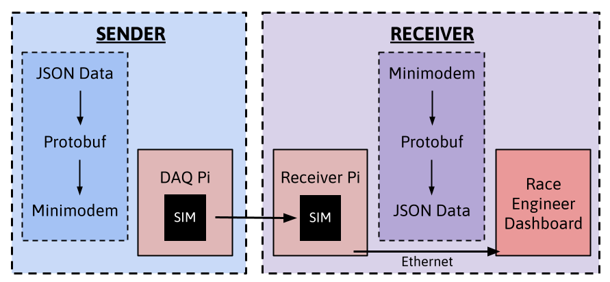

# Redundant Telemetry Protocol

A backup wireless telemetry protocol that converts vehicle sensor data (JSON) into Protocol Buffer packets, transmits them via the selected communication method, and decodes the data for visualization on the Race Engineer Dashboard.

### Transmission Modes 
1. [Minimodem](https://www.whence.com/minimodem/) (encodes data into audio tones using Frequency-Shift Keying modulation)
2. UDP over Starlink (see below)

### Important UDP Note

UDP support remains in this repository for **local testing and development only**.

For competition, ROS is the primary telemetry method.

---

## Installation

**WINDOWS USERS:** Minimodem does not run natively on Windows. Install WSL2 with Ubuntu and run this project in the WSL terminal if you plan to use modem mode. 

Clone repo with submodules: 
```bash
git clone --recurse-submodules https://github.com/cornellev/redundant-telemetry.git
cd redundant-telemetry
```

If you already cloned without submodules:
```bash
git submodule update --init --recursive
```

---

## Dependencies

Install Python dependencies:
```bash
pip install -r requirements.txt
```

If you plan to use modem mode, install Minimodem: 
```bash
# macOS
brew install minimodem

# Windows/Linux (Ubuntu/WSL)
sudo apt-get update && sudo apt-get install -y minimodem
```

Note: `sender.py` requires the SHM reader class from the [UC26 Sensor Reader repo](https://github.com/cornellev/uc26_sensor_reader.git), included as a git submodule (configured in `.gitmodules`). Clone with submodules as shown above before running the project.

---

## Configuration

Create your local environment file from the template and set corresponding values in `.env`:
- `DATA_TRANSFER_BAUD`
- `DATA_TRANSFER_UDP_HOST`
- `DATA_TRANSFER_UDP_PORT`
- `DATA_TRANSFER_SENDER_NUMBER`
- `DATA_TRANSFER_RECEIVER_NUMBER`
- `DATA_TRANSFER_MODEM_PORT`
- `DATA_TRANSFER_MODEM_POWER_KEY`
- `DATA_TRANSFER_MODEM_BAUD`

---

## How to Run

This repo uses a `src` layout, so set `PYTHONPATH=src` before running modules.

### PowerShell
```powershell
$env:PYTHONPATH="src"
python -m receiver.receiver --mode udp
python -m sender.sender --mode udp
```

### Bash/Zsh
```bash
export PYTHONPATH=src
python -m receiver.receiver --mode udp
python -m sender.sender --mode udp
```

Use `--mode modem` instead of `--mode udp` to transfer data via minimodem.

---

## Runtime Behavior

Sender behavior:
- Continuously streams protobuf packets using the data from `SensorShmReader`.

Receiver behavior:
- Modem mode: powers on the SIM7600, answers an incoming call, receives/decodes packets in a loop, then hangs up.
- UDP mode (current implementation): uses a `2.0` second idle timeout to exit if no packets are received (this timeout is customizable in `receiver.py`).

---

## Project Structure
```text
redundant-telemetry/
|-- src/
|   |-- config.py                         # Runtime configuration for transmission mode
|   |-- hardware/
|   |   |-- cellular_modem.py             # SIM7600 GPIO + serial control helper
|   |   `-- __init__.py
|   |-- modes/
|   |   |-- interface.py
|   |   |-- modem_mode.py                 # minimodem transfer implementation
|   |   |-- udp_mode.py                   # UDP transfer implementation
|   |   `-- __init__.py
|   |-- receiver/
|   |   |-- receiver.py                   # Receives packets and decodes protobuf frames
|   |   `-- __init__.py
|   |-- sender/
|   |   |-- sender.py                     # Reads SHM, serializes, and sends
|   |   `-- __init__.py
|   |-- schema/                           # Generated protobuf Python runtime files
|   |   |-- data_pb2.py
|   |   `-- __init__.py
|   `-- __init__.py
|-- .gitmodules                           
|-- schema/                               # Protobuf source schema directory
|   `-- data.proto
|-- .env.example
|-- requirements.txt
`-- README.md
```

---

## System Diagram 


---

## Sensor Protobuf Schema

`Sensors` message fields:
- `seq`
- `global_ts`
- `power { ts, current, voltage }`
- `steering { ts, brake_pressure, turn_angle }`
- `rpm_front { ts, rpm_left, rpm_right }`
- `rpm_back { ts, rpm_left, rpm_right }`
- `gps { ts, gps_lat, gps_long }`
- `motor { ts, rpm, throttle }`

---

## Adding/Editing Protobuf Schemas

This system uses [Google Protocol Buffers](https://protobuf.dev/getting-started/pythontutorial/) to define structured messages.

### Edit Existing Schema

1. Edit `schema/data.proto`.
2. Regenerate Python bindings:

```bash
protoc --python_out=src schema/data.proto
```

### Add New Schema 

1. Add a new `.proto` file under `schema/` (example: `schema/new_data.proto`).
2. Generate Python bindings for the new file:

```bash
protoc --python_out=src schema/new_data.proto
```

3. Commit both:
- the `.proto` source file in `schema/`
- the generated `*_pb2.py` file in `src/schema/`
